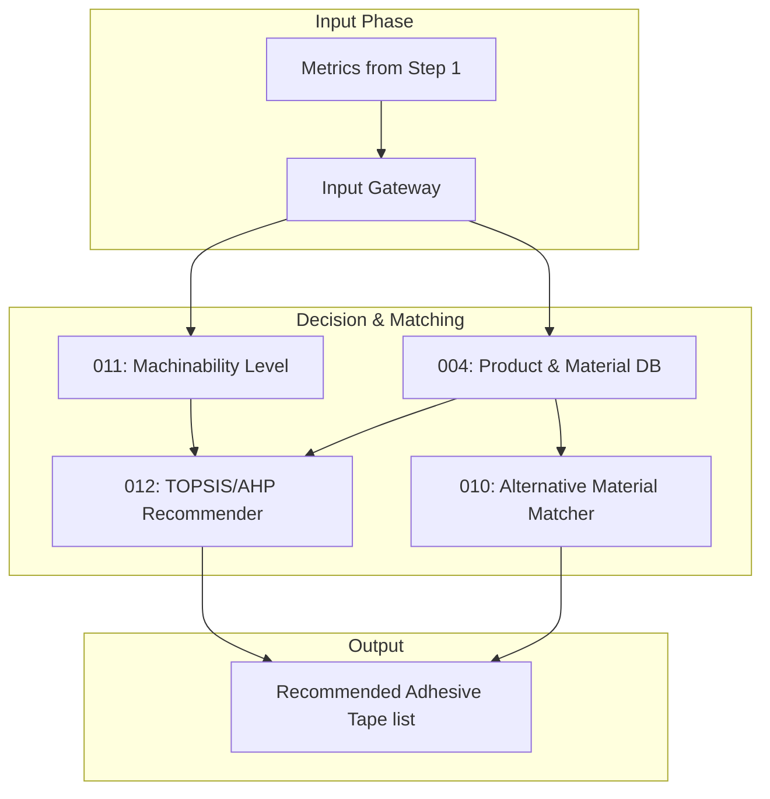

# 통합 표면 분석 플랫폼 - Step 2: 매칭 (SG_integration_step2)


## 1. 개요
Step 1에서 계측된 데이터(표면 에너지, 조도, 광택도, 곡률 등)를 기반으로 가공 난이도를 평가하고, 사내 DB를 쿼리하여 최적의 자사 제품을 추천하는 의사결정 플랫폼입니다. 

## 2. 아키텍처 다이어그램


## 3. 주요 포함 모듈 (Git Submodule)
- **SG_proj_011**: 곡률 데이터를 기반으로 가공 가혹도(Level 1~5) 평가
- **SG_proj_004**: 자사 점착제 제품 및 피착재 기준 SQLite 중앙 DB
- **SG_proj_012**: 다기준 의사결정(MCDA) 알고리즘 적용 최적 제품 추천
- **SG_proj_010**: 추천 제품이 없을 경우 대체 피착재 매칭

## 4. 실행 방법
```bash
git submodule update --init --recursive
streamlit run app.py
```
