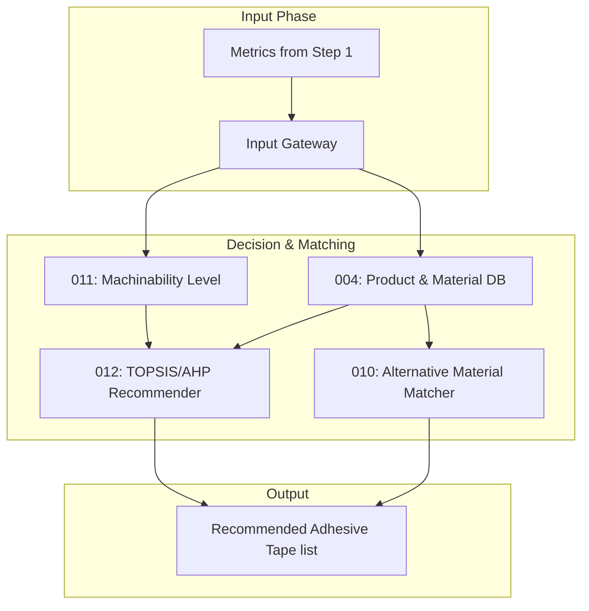

# 통합 표면 분석 플랫폼 - Step 2: 매칭 (SG_integration_step2)


## 1. 개요
Step 1에서 계측된 데이터(표면 에너지, 조도, 광택도, 곡률 등)를 기반으로 가공 난이도를 평가하고, 사내 DB를 쿼리하여 최적의 자사 제품을 추천하는 의사결정 플랫폼입니다. 

## 2. 아키텍처 다이어그램

```mermaid
graph TD
    subgraph Input Phase
        A[Metrics from Step 1] --> B[Input Gateway]
    end
    subgraph Decision & Matching
        B --> C[011: Machinability Level]
        B --> D[004: Product & Material DB]
        C --> E[012: TOPSIS/AHP Recommender]
        D --> E
        D --> F[010: Alternative Material Matcher]
    end
    subgraph Output
        E --> G[Recommended Adhesive Tape list]
        F --> G
    end
```

## 3. 주요 포함 모듈 (Git Submodule)
- **SG_proj_011**: 3D 곡률 및 재재 강성을 연산하여 공정 가혹도(Level 1~5) 평가 (FastAPI 물리 API)
- **SG_proj_004**: 자사 제품 물성 스펙 및 피착재 기준 데이터베이스 (PostgreSQL 및 Qdrant Vector DB Docker 컨테이너 연동 API)
- **SG_proj_012**: 순위 역전(Rank Reversal) 현상을 제거한 절대 기준 스케일링(Reference-Bounds) TOPSIS 최적 매칭 엔진
- **SG_proj_010**: 추천 제품이 없을 경우 대체 피착재 재질 매칭 및 가이드

## 4. 최근 업데이트 내역
- [데이터 인프라 마이그레이션]: 기존 로컬 SQLite 모놀리식 조회 구조를 폐기하고, `SG_DB`의 PostgreSQL 및 Qdrant Vector DB와 연동되는 FastAPI REST API 체계로 전면 전환하였습니다.
- [매칭 엔진 정밀화]: TOPSIS 알고리즘 구동 시 이상해/부정해 정규화 스케일링을 데이터셋 내부 상대값이 아닌 절대 한계치(`reference_bounds`) 기준으로 통일하여 순위 역전 왜곡을 차단했습니다.
- [가중치 최적화]: 현장 실측 데이터셋(Ground Truth)을 모사하여 매칭 목적 함수의 속성별 가중치를 자동 산출하는 오프라인 가중치 최적화 도구(`optimize_weights.py`)를 탑재했습니다.

## 5. 실행 방법
```bash
git submodule update --init --recursive
streamlit run app.py
```

---
*Last Updated: 2026-08-20 (MCDA Refactoring & MSA Database Integration)*
